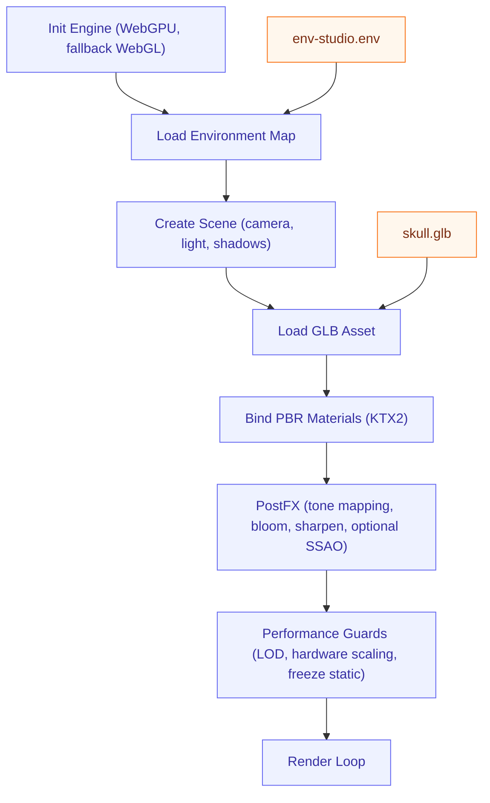

# Runtime Rendering Pipeline

```mermaid
flowchart TB
  classDef stage fill:#EEF2FF,stroke:#6366F1,color:#3730A3;
  classDef file fill:#FFF7ED,stroke:#F97316,color:#7C2D12;

  Engine["Init Engine (WebGPU, fallback WebGL)"]:::stage
  EnvFile["env-studio.env"]:::file
  GLBFile["skull.glb"]:::file

  LoadEnv["Load Environment Map"]:::stage
  SceneSetup["Create Scene (camera, light, shadows)"]:::stage
  LoadGLB["Load GLB Asset"]:::stage
  BindMaterials["Bind PBR Materials (KTX2)"]:::stage
  PostFX["PostFX (tone mapping, bloom, sharpen, optional SSAO)"]:::stage
  PerfGuards["Performance Guards (LOD, hardware scaling, freeze static)"]:::stage
  RenderLoop["Render Loop"]:::stage

  Engine --> LoadEnv
  EnvFile --> LoadEnv
  LoadEnv --> SceneSetup
  SceneSetup --> LoadGLB
  GLBFile --> LoadGLB
  LoadGLB --> BindMaterials
  BindMaterials --> PostFX
  PostFX --> PerfGuards
  PerfGuards --> RenderLoop
```
